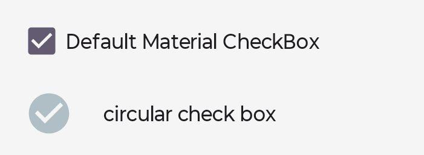
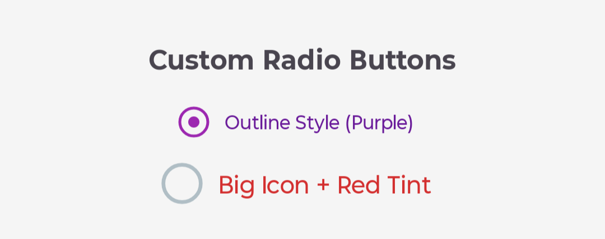
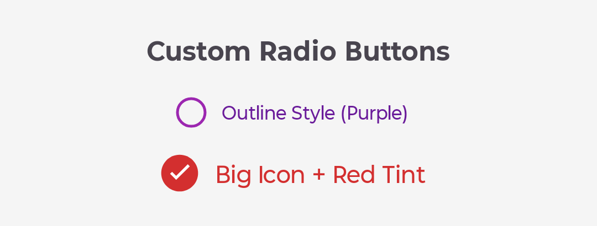

# Custom CheckBox & RadioButton Library

[](https://kotlinlang.org/)
[](LICENSE)
[](#)

**Custom CheckBox & RadioButton Library** is an Android library that provides highly customizable CheckBox and RadioButton components. Easily change icons, colors, paddings, margins, and background tints through XML attributes or programmatically at runtime.

---

## 📸 Preview

| Default CheckBox | Custom  Radio Buttons | Custom Radio Buttons |
|------------------|--------------------------|----------------------|
|  |  |  |

---

## ✨ Features

- **Custom Icons**: Use any drawable for checked/unchecked states
- **Flexible Styling**: Control paddings, margins, icon spacing, and background tints
- **Runtime Customization**: Change appearance programmatically at any time
- **Material Design Compatible**: Extends `AppCompatCheckBox` and `AppCompatRadioButton`
- **Easy Integration**: Simple XML attributes for quick customization
- **Lightweight**: Minimal overhead, uses native Android components

---

## 📦 Installation

**Step 1:** Add JitPack repository to your root `build.gradle`:

```gradle
allprojects {
    repositories {
        maven { url 'https://jitpack.io' }
    }
}
```

**Step 2:** Add dependency to your app module's `build.gradle`:

```gradle
dependencies {
	       implementation("com.github.Excelsior-Technologies-Community:CustomCheckboxRadio:1.0.1")

}
```

---

## 🚀 Usage

### CustomCheckBox - XML

```xml
<!-- Default Material CheckBox -->
<com.ext.custom_checkbox_radiobutton.CustomCheckBox
    android:id="@+id/checkbox1"
    android:layout_width="wrap_content"
    android:layout_height="wrap_content"
    android:text="Default Material CheckBox" />

<!-- Custom Circular CheckBox -->
<com.ext.custom_checkbox_radiobutton.CustomCheckBox
    android:id="@+id/checkbox2"
    android:layout_width="wrap_content"
    android:layout_height="wrap_content"
    android:text="Circular CheckBox"
    app:checkboxCheckedIcon="@drawable/ic_check_circle_32"
    app:checkboxUncheckedIcon="@drawable/ic_circle_gray_32dp"
    app:checkboxIconPadding="10dp"
    app:checkboxPaddingStart="20dp"
    app:checkboxPaddingEnd="20dp"
    app:checkboxBackgroundTintColor="@color/black" />
```

### CustomRadioButton - XML

```xml
<RadioGroup
    android:id="@+id/radioGroup"
    android:layout_width="match_parent"
    android:layout_height="wrap_content"
    android:orientation="vertical">

    <!-- Purple Outline Style -->
    <com.ext.custom_checkbox_radiobutton.CustomRadioButton
        android:layout_width="wrap_content"
        android:layout_height="wrap_content"
        android:text="Outline Style (Purple)"
        android:textColor="#6A1B9A"
        app:radioCheckedIcon="@drawable/ic_radio_checked_purple"
        app:radioUncheckedIcon="@drawable/ic_radio_unchecked_purple"
        app:radioIconPadding="20dp"
        app:radioPaddingStart="10dp"
        app:radioPaddingEnd="10dp"
        app:radioBackgroundTintColor="#F3E5F7" />

    <!-- Big Icon with Red Tint -->
    <com.ext.custom_checkbox_radiobutton.CustomRadioButton
        android:layout_width="wrap_content"
        android:layout_height="wrap_content"
        android:text="Big Icon + Red Tint"
        android:textColor="#D32F2F"
        android:textSize="18sp"
        app:radioCheckedIcon="@drawable/ic_check_circle_red_32dp"
        app:radioUncheckedIcon="@drawable/ic_circle_gray_32dp"
        app:radioIconPadding="16dp"
        app:radioPaddingStart="10dp"
        app:radioPaddingEnd="10dp"
        app:radioBackgroundTintColor="#FFEBEE" />

</RadioGroup>
```

---

## 💻 Kotlin Programmatic Usage

### CustomCheckBox

```kotlin
val customCheckBox = findViewById<CustomCheckBox>(R.id.checkbox2)

// Change icons at runtime
customCheckBox.setCheckedIcon(
    ContextCompat.getDrawable(this, R.drawable.ic_check_circle_red_32dp)
)
customCheckBox.setUncheckedIcon(
    ContextCompat.getDrawable(this, R.drawable.ic_circle_gray_32dp)
)

// Change icon padding
customCheckBox.setIconPadding(20)

// Change paddings
customCheckBox.setCustomPaddings(
    start = 40,
    top = 24,
    end = 40,
    bottom = 24
)

// Change margins
customCheckBox.setCustomMargins(
    start = 16,
    top = 8,
    end = 16,
    bottom = 8
)

// Change background tint
customCheckBox.setBackgroundTint(Color.parseColor("#FFEBEE"))

// Update text and appearance
customCheckBox.text = "Dynamically Changed!"
customCheckBox.textSize = 18f
customCheckBox.setTextColor(Color.parseColor("#D32F2F"))

// Toggle checked state
customCheckBox.isChecked = !customCheckBox.isChecked
```

### CustomRadioButton

```kotlin
val customRadio = findViewById<CustomRadioButton>(R.id.radio1)

// Change icons
customRadio.setCheckedIcon(
    ContextCompat.getDrawable(this, R.drawable.ic_radio_checked_purple)
)
customRadio.setUncheckedIcon(
    ContextCompat.getDrawable(this, R.drawable.ic_radio_unchecked_purple)
)

// Configure appearance
customRadio.setIconPadding(24)
customRadio.setCustomPaddings(32, 16, 32, 16)
customRadio.setCustomMargins(20, 10, 20, 10)
customRadio.setBackgroundTint(Color.parseColor("#F3E5F7"))

// Set checked state
customRadio.isChecked = true
```

---

## 🔧 XML Attributes

### CustomCheckBox Attributes

| Attribute | Type | Default | Description |
|-----------|------|---------|-------------|
| checkboxCheckedIcon | reference | null | Drawable for checked state |
| checkboxUncheckedIcon | reference | null | Drawable for unchecked state |
| checkboxIconPadding | dimension | 0dp | Space between icon and text |
| checkboxPaddingStart | dimension | default | Left/Start padding |
| checkboxPaddingEnd | dimension | default | Right/End padding |
| checkboxPaddingTop | dimension | default | Top padding |
| checkboxPaddingBottom | dimension | default | Bottom padding |
| checkboxMarginStart | dimension | 0dp | Left/Start margin |
| checkboxMarginEnd | dimension | 0dp | Right/End margin |
| checkboxMarginTop | dimension | 0dp | Top margin |
| checkboxMarginBottom | dimension | 0dp | Bottom margin |
| checkboxBackgroundTintColor | color | none | Background tint color |

### CustomRadioButton Attributes

| Attribute | Type | Default | Description |
|-----------|------|---------|-------------|
| radioCheckedIcon | reference | null | Drawable for checked state |
| radioUncheckedIcon | reference | null | Drawable for unchecked state |
| radioIconPadding | dimension | 0dp | Space between icon and text |
| radioPaddingStart | dimension | default | Left/Start padding |
| radioPaddingEnd | dimension | default | Right/End padding |
| radioPaddingTop | dimension | default | Top padding |
| radioPaddingBottom | dimension | default | Bottom padding |
| radioMarginStart | dimension | 0dp | Left/Start margin |
| radioMarginEnd | dimension | 0dp | Right/End margin |
| radioMarginTop | dimension | 0dp | Top margin |
| radioMarginBottom | dimension | 0dp | Bottom margin |
| radioBackgroundTintColor | color | none | Background tint color |

---

## 📝 Methods

### CustomCheckBox Methods

```kotlin
fun setCheckedIcon(drawable: Drawable?)           // Set checked state icon
fun setUncheckedIcon(drawable: Drawable?)         // Set unchecked state icon
fun setIconPadding(padding: Int)                  // Set icon padding
fun setCustomPaddings(start: Int, top: Int, end: Int, bottom: Int)  // Set paddings
fun setCustomMargins(start: Int, top: Int, end: Int, bottom: Int)   // Set margins
fun setBackgroundTint(color: Int)                 // Set background tint
```

### CustomRadioButton Methods

```kotlin
fun setCheckedIcon(drawable: Drawable?)           // Set checked state icon
fun setUncheckedIcon(drawable: Drawable?)         // Set unchecked state icon
fun setIconPadding(padding: Int)                  // Set icon padding
fun setCustomPaddings(start: Int, top: Int, end: Int, bottom: Int)  // Set paddings
fun setCustomMargins(start: Int, top: Int, end: Int, bottom: Int)   // Set margins
fun setBackgroundTint(color: Int)                 // Set background tint
```

## 📄 License

```
MIT License

Copyright (c) 2025 Excelsior Technologies 

Permission is hereby granted, free of charge, to any person obtaining a copy
of this software and associated documentation files (the "Software"), to deal
in the Software without restriction, including without limitation the rights
to use, copy, modify, merge, publish, distribute, sublicense, and/or sell
copies of the Software, and to permit persons to whom the Software is
furnished to do so, subject to the following conditions:

The above copyright notice and this permission notice shall be included in all
copies or substantial portions of the Software.

THE SOFTWARE IS PROVIDED "AS IS", WITHOUT WARRANTY OF ANY KIND, EXPRESS OR
IMPLIED, INCLUDING BUT NOT LIMITED TO THE WARRANTIES OF MERCHANTABILITY,
FITNESS FOR A PARTICULAR PURPOSE AND NONINFRINGEMENT. IN NO EVENT SHALL THE
AUTHORS OR COPYRIGHT HOLDERS BE LIABLE FOR ANY CLAIM, DAMAGES OR OTHER
LIABILITY, WHETHER IN AN ACTION OF CONTRACT, TORT OR OTHERWISE, ARISING FROM,
OUT OF OR IN CONNECTION WITH THE SOFTWARE OR THE USE OR OTHER DEALINGS IN THE
SOFTWARE.
```

---


---

